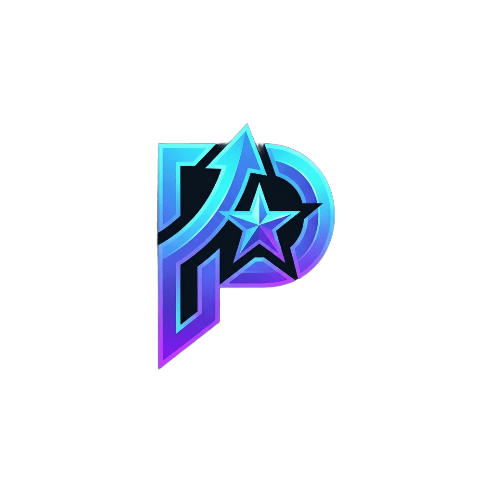

<div align="center">
  

  # Paragon

  **El siguiente platino no se espera.**
  Rastreador de trofeos y logros de PlayStation, Steam y Xbox — tu progreso, el de tus amigos, y qué te falta para el 100%.

  
  
  
  
  
  
  

</div>

---

## Qué hace

- **Trofeos y logros reales**, no una copia manual: se leen directamente de PlayStation Network, Steam y Xbox (vía OpenXBL), con el ID/gamertag público de cada uno — nunca una contraseña.
- **Biblioteca ordenada por lo que falta**, no por lo que ya tienes. El platino es la consecuencia, no la tarea.
- **Trofeos perdibles** marcados aparte, con guías de vídeo y guías escritas por la comunidad para cada uno.
- **Social de verdad**: amigos por handle, comparativas juego a juego, ligas privadas mensuales con ranking y podio.
- **El Wrap**: tu año en trofeos, con genero más jugado, juego más exprimido y ranking global detrás de cada cifra.
- **Descubre**: catálogo cruzado con IGDB, próximos lanzamientos, Xbox Game Pass, precios históricos (CheapShark + IsThereAnyDeal) y noticias/eSports.
- **Modo enfoque**: pantalla a pantalla completa con los trofeos más a mano y un oráculo que predice cuándo terminas al ritmo real de cada uno.
- **Multi-idioma** (ES/EN/DE/FR) con `next-intl`, notificaciones push de verdad, PWA instalable, y una app nativa Android/iOS vía Capacitor.
- Hasta un **easter egg**: el equivalente de Paragon al dinosaurio de Chrome, escondido en la pantalla sin conexión.

## Cómo está montado

**Ningún usuario entrega credenciales de una plataforma.** Cada plataforma tiene UNA credencial de servidor (`PSN_NPSSO`, `STEAM_API_KEY`, `XBL_API_KEY`) con la que se leen los perfiles *públicos* de todo el mundo — el usuario solo escribe su ID/gamertag. El precio: un perfil de trofeos en privado no se puede sincronizar.

**El login de la app es aparte**, con Google o Discord vía Auth.js. No guardamos contraseñas.

**Los amigos se añaden por handle** (`@mario_16`), no por ID de plataforma. El handle lo elige el usuario y es lo que se comparte en público.

```
src/
  auth.ts                Auth.js: proveedores, sesión, adaptador
  db/schema.ts            Todas las tablas: usuarios, juegos, trofeos, ligas...
  i18n/request.ts         Fusiona los namespaces de messages/ en cada petición
  lib/
    psn/ steam/ xbl/      Un cliente por plataforma, misma forma de salida
    profiles.ts           Único punto de acceso a datos (BD + plataformas + caché)
    sync.ts                Sincronización: biblioteca + detalle de trofeos
    stats.ts               Progreso, próximos pasos, comparativas
  app/
    api/cron/sync/         Sincronización desatendida, por tandas y con reloj
    admin/                  Panel interno (solo esDesarrollador)
    ...                     El resto de páginas y server actions
messages/
  manifest.ts              Lista de namespaces de traducción
  <Namespace>/{es,en,de,fr}.json
android/                  App nativa (Capacitor)
```

Las páginas nunca hablan con una plataforma ni con la base de datos directamente: pasan por `lib/profiles.ts`. Añadir una plataforma nueva se hace ahí, sin tocar pantallas.

## Puesta en marcha

```bash
npm install
cp .env.example .env.local   # y rellenarlo, ver abajo
npx drizzle-kit push          # crea las tablas
npm run dev
```

### Variables de entorno

`.env.example` trae, para cada una, de dónde sacarla exactamente. Resumen:

| Variable | Para qué |
|---|---|
| `DATABASE_URL` / `DIRECT_URL` | Postgres gestionado (Supabase, Neon, Vercel Postgres). |
| `AUTH_SECRET`, `AUTH_GOOGLE_*`, `AUTH_DISCORD_*` | Login con Auth.js. |
| `PSN_NPSSO` | Lector de PlayStation. Caduca cada ~2 meses. |
| `STEAM_API_KEY` | Lector de Steam. No caduca. |
| `XBL_API_KEY` | Lector de Xbox, vía OpenXBL (no oficial). |
| `CRON_SECRET` | Protege la ruta de sincronización automática. |
| `IGDB_CLIENT_ID` / `_SECRET` | Catálogo mundial de juegos (OAuth de Twitch). |
| `ITAD_API_KEY` | Histórico de precios en el tiempo. Opcional. |
| `VAPID_*` | Notificaciones push del navegador. Opcional. |
| `DISCORD_BOT_TOKEN` / `_PUBLIC_KEY` / `_APPLICATION_ID` | Bot de avisos por DM. Opcional. |
| `NEXT_PUBLIC_SUPABASE_URL`, `SUPABASE_SERVICE_ROLE_KEY` | Subida de imágenes (avatares, banners). |

Al desplegar, repite los redirect URI de OAuth con el dominio real y vuelve a cargar las variables en el proveedor.

### Scripts

| Comando | Qué hace |
|---|---|
| `npm run dev` | Servidor de desarrollo. |
| `npm run build` / `npm start` | Build y arranque en producción. |
| `npm run lint` | ESLint. |
| `npm run db:push` | Aplica el esquema de Drizzle contra la base de datos. |
| `npm run db:studio` | Explorador visual de la base de datos. |

## Limitaciones conocidas

- **El progreso parcial de un trofeo** ("31 de 48 cuervos") solo lo exponen algunos juegos de PS5, y depende de campos que la API no garantiza. Se lee de forma defensiva: si no viene, no se muestra.
- **Qué coleccionable concreto llevas** no lo da ninguna API: vive en el save del juego, cifrado y distinto en cada título. No se puede resolver a escala.
- **Epic Games, Google Play y Ubisoft Connect** no tienen lector propio todavía: ninguna de las tres da una API pública documentada para leer logros de terceros.
- **Xbox va contra un servicio no oficial** (OpenXBL, no Microsoft), con un cupo gratuito compartido entre todos los usuarios — puede romperse o cambiar de condiciones sin avisar.

---

<div align="center">
  <sub>Proyecto personal. No afiliado a Sony, Valve ni Microsoft.</sub>
</div>
